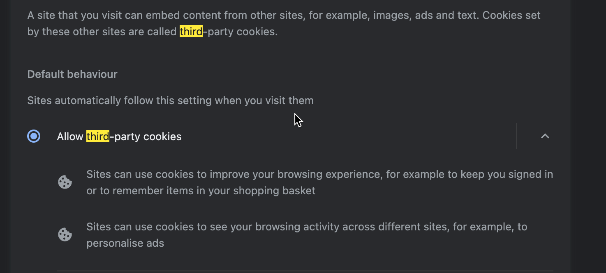
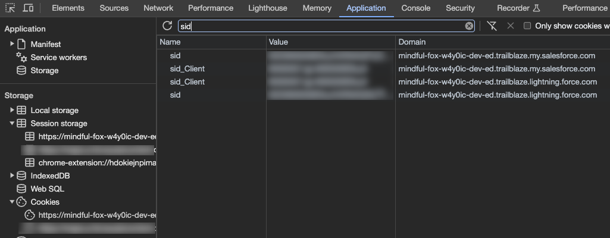

# Troubleshooting

## Common issues that may occurs

### Blank popup

You've just installed Salesforce Inspector Reloaded and ... the popup is blank 😥
Make sure that third party cookies are enabled in your browser:

### Salesforce Inspector Reloaded is not working anymore
One of the cause can be a domain update (hyperforce migration, MyDomain activation ...)
What you need to do is to delete the sid cookie (and website associated cookies if sid did not worked)

